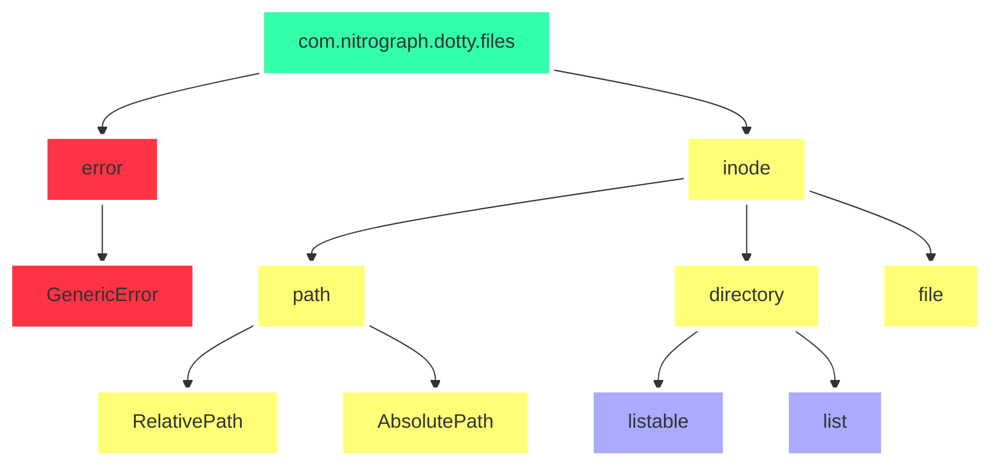

## `com.nitrograph.lib(dotty.files)`
```scala
    for Dotty in Dotty
        yield lib(dotty ~: files)
```
## `lib(dotty.files).domain`
```scala
    for entity in lib(dotty.files).domain
        yield {
            _.(errors | inode)
        }
```

## `lib(dotty.files).dependencies.asGraph`


## `lib(dotty.files).dependencies.asStructuredText`
```scala
com.nitrograph {
    lib(dotty.files) {
        errors {
            GenericError
        }
        path {
            AbsolutePath {}
            RelativePath {}
        }
        inode {
            // file.write(File.Start)
            def write(
                from: FilePosition,
                to: FilePosition,
                what: (
                    Bytes | String | DottyINode
                )
            ): (
                Success | Failure
            )

            DottyDirectory {
                def list: DirectoryChildren
                def listable: Boolean
            }
            DottyFile {
                val readUtf8Text = Functor(
                )
            }
        }
    }
}
```
